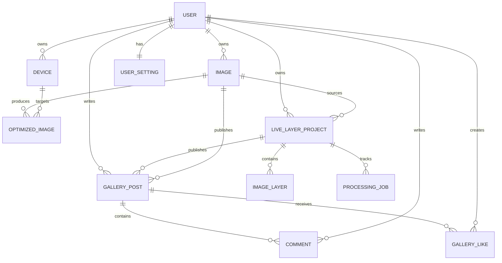

# Upscale Lab Backend Architecture

## 구성 원칙

- 클라이언트는 데이터베이스나 S3에 직접 접근하지 않고 API만 호출합니다.
- 원본 및 최적화 이미지 바이너리는 S3에 저장하고 PostgreSQL에는 메타데이터와 S3 object key만 저장합니다.
- 모든 사용자 소유 리소스 쿼리는 인증된 `UserId`를 조건에 포함합니다.
- 수정 가능한 데이터는 UTC `UpdatedAt`을 사용하여 향후 최신 수정 우선 동기화 정책을 적용할 수 있습니다.
- SignalR의 `/hubs/notifications` 기반만 제공하며 도메인 이벤트 연결은 후속 작업입니다.

## Entity 관계

주요 제약 조건:

- `users.email` unique
- `users.username` unique
- `user_settings.user_id` unique
- `gallery_likes(gallery_post_id, user_id)` unique
- `optimized_images(image_id, device_id, orientation)` unique

## 이미지 처리 흐름

1. 인증된 클라이언트가 `POST /api/images`로 이미지와 크기 메타데이터를 전송합니다.
2. API가 S3에 원본을 저장하고 PostgreSQL에 `Image`를 기록합니다.
3. 향후 업스케일 작업자가 S3 입력 URL로 Replicate Real-ESRGAN prediction을 생성합니다.
4. 완료 결과를 S3로 복사하고 `OptimizedImage`에 대상 Device/방향/크기를 기록합니다.
5. 클라이언트는 짧은 수명의 pre-signed download URL을 API로 발급받습니다.

현재 1~2단계와 다운로드 URL 발급은 구현되어 있습니다. Replicate 호출 서비스는 구현되어 있으나 prediction polling, 결과 S3 복사, `OptimizedImage` 기록을 하나의 내구성 있는 background job으로 묶는 작업은 아직 남아 있습니다.

## API

| Method | Path | 인증 | 용도 |
|---|---|---:|---|
| GET | `/health` | 없음 | 프로세스 상태 확인 |
| POST | `/api/auth/register` | 없음 | 회원가입, BCrypt hash, Cognito 인증 코드 발송 |
| POST | `/api/auth/verify-email` | 없음 | 6자리 이메일 인증 후 JWT 발급 |
| POST | `/api/auth/resend-verification` | 없음 | 이메일 인증 코드 재전송 |
| POST | `/api/auth/login` | 없음 | 로그인 및 JWT 발급 |
| GET | `/api/auth/me` | 필요 | 현재 사용자 조회 |
| GET/POST | `/api/devices` | 필요 | 내 디바이스 목록/등록 |
| PUT/DELETE | `/api/devices/{id}` | 필요 | 내 디바이스 수정/삭제 |
| GET/PUT | `/api/settings` | 필요 | 내 동기화/방향/업스케일 설정 |
| GET/POST | `/api/images` | 필요 | 내 이미지 목록/업로드 |
| GET/DELETE | `/api/images/{id}` | 필요 | 내 이미지 조회/삭제 |
| POST | `/api/images/{id}/download-url` | 필요 | 내 원본 pre-signed URL 발급 |
| GET/POST | `/api/gallery` | 조회 공개, 등록 필요 | 갤러리 목록/등록 |
| GET/DELETE | `/api/gallery/{id}` | 조회 공개, 삭제 필요 | 상세/본인 게시글 삭제 |
| POST | `/api/gallery/{id}/comments` | 필요 | 댓글 등록 |
| DELETE | `/api/comments/{id}` | 필요 | 댓글 작성자/게시글 작성자 삭제 |
| POST/DELETE | `/api/gallery/{id}/likes` | 필요 | 좋아요/취소 |
| POST | `/api/gallery/{id}/download-url` | 없음 | 다운로드 URL 발급 및 카운트 증가 |
| SignalR | `/hubs/notifications` | 필요 | 향후 실시간 알림 기반 |
| GET/POST | `/api/projects` | 필요 | 내 LiveLayer 목록/원본 업로드 |
| GET/DELETE | `/api/projects/{id}` | 필요 | 프로젝트 상세/삭제 |
| POST | `/api/projects/{id}/process` | 필요 | 비동기 See-through 처리 시작 |
| GET | `/api/projects/{id}/processing-status` | 필요 | 최신 처리 상태 조회 |
| GET | `/api/projects/{id}/layers` | 필요 | 렌더링 레이어 조회 |
| PATCH | `/api/projects/{id}/layers/{layerId}` | 필요 | depth/transform/movement 수정 |

## LiveLayer AI 경계

- API와 영속성은 기존 ASP.NET Core/EF Core 구조를 유지합니다.
- `ProcessingJob`이 queue 상태를 DB에 보존하고 단일 background worker가 처리합니다. 프로세스 재시작 시 `Queued`/`Processing` 작업을 다시 queue에 넣습니다.
- Python 어댑터는 See-through 저장소를 vendoring하지 않고 공식 `inference/scripts/inference_psd.py`를 실행합니다.
- 성공 결과만 기존 레이어와 원자적으로 교체하며, 실패 시 기존 완료 레이어는 보존합니다.
- Project, Layer, 비공개 GalleryPost 조회는 항상 인증 UserId 또는 공개 여부를 확인합니다.

## 보안 경계

- JWT secret, DB connection string, S3 bucket, Replicate token은 설정 공급자에서만 읽습니다.
- 비밀번호는 10~128자이며 대문자, 숫자, 특수문자를 각각 포함해야 합니다.
- 비밀번호 원문은 DB 또는 응답에 저장하지 않고 BCrypt(work factor 12) 단방향 해시만 저장합니다.
- 이메일 인증 코드 생성·전송·검증은 Cognito가 담당하며 애플리케이션 DB에는 코드를 저장하지 않습니다.
- Cognito 인증 코드는 24시간 유효하며 API는 재전송 60초 제한과 인증 전 로그인 차단을 적용합니다.
- Cognito app client secret은 설정 공급자에서만 읽습니다.
- AWS SDK는 기본 credential chain을 사용하며 EC2 IAM Role을 우선합니다.
- S3 bucket은 public access block을 유지하고 pre-signed URL 방식으로 다운로드합니다.
- CORS 허용 origin은 명시 목록이며 `AllowAnyOrigin`과 credentials를 함께 사용하지 않습니다.
